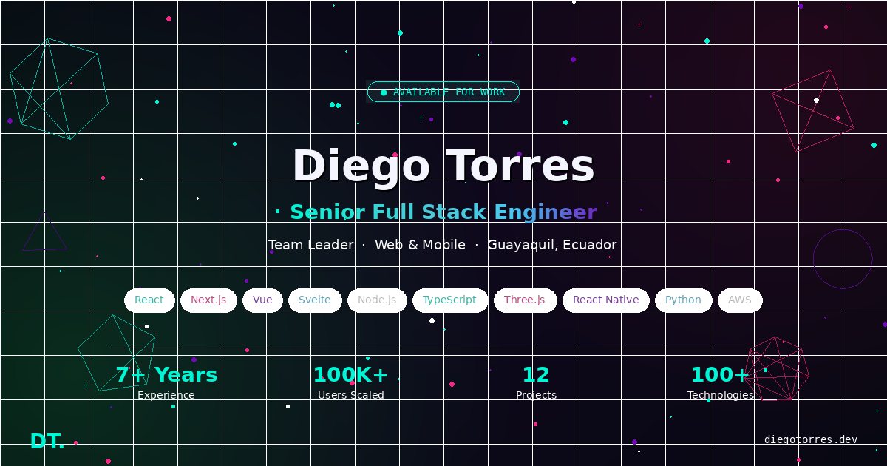

# Diego Torres — Portfolio

A modern, interactive portfolio website built with **Next.js** and **Three.js**, featuring a 3D animated hero, scroll-reveal animations, and a dark-themed design with cyan/magenta/violet accents.



## ✨ Features

- **Interactive 3D Hero** — Wireframe geometries (icosahedron, torus, octahedron, torus knot, dodecahedron) with mouse-responsive camera and floating particle system powered by Three.js
- **Scroll Reveal Animations** — Sections animate into view using IntersectionObserver with cubic-bezier easing
- **Animated Stat Counters** — Numbers count up when scrolled into view
- **Glass-morphism Navbar** — Transparent-to-blur navigation with active section tracking and mobile hamburger menu
- **Cursor Glow Effect** — Radial gradient follows mouse movement across the page
- **10 Skill Categories** — 100+ technologies displayed in color-coded cards
- **Experience Timeline** — 4 roles with detailed highlights and timeline connector
- **12 Project Cards** — Gradient headers with hover micro-interactions and metric badges
- **Working Contact Form** — Sends real emails via Web3Forms (no backend required)
- **Fully Responsive** — Optimized for desktop, tablet, and mobile

## 🛠 Tech Stack

| Layer | Technologies |
|-------|-------------|
| Framework | Next.js 15, React 19 |
| 3D Graphics | Three.js |
| Styling | Inline CSS-in-JS, Google Fonts (Syne, DM Sans, JetBrains Mono) |
| Contact Form | Web3Forms API |
| Deployment | Vercel |

## 📂 Project Structure

```
portfolio/
├── public/
│   ├── favicon.ico
│   └── og-image.png
├── src/
│   ├── app/
│   │   ├── globals.css
│   │   ├── layout.js
│   │   └── page.js
│   └── components/
│       └── Portfolio.jsx
├── package.json
├── next.config.mjs
└── README.md
```

## 🚀 Getting Started

### Prerequisites

- Node.js 18+
- npm or yarn

### Installation

```bash
# Create Next.js app
npx create-next-app@latest portfolio

# Navigate into project
cd portfolio

# Install Three.js
npm install three
```

### Setup

1. **Replace `src/app/globals.css`** with global styles (scrollbar, keyframes, selection)

2. **Replace `src/app/layout.js`** with root layout including Google Fonts and SEO metadata

3. **Replace `src/app/page.js`** with:
   ```jsx
   "use client";
   export { default } from "@/components/Portfolio";
   ```

4. **Add `src/components/Portfolio.jsx`** — the main portfolio component

5. **Set your Web3Forms key** in `Portfolio.jsx`:
   ```js
   access_key: "YOUR_ACCESS_KEY_HERE"
   ```
   Get a free key at [web3forms.com](https://web3forms.com)

6. **Add `og-image.png`** to the `public/` directory

### Run Development Server

```bash
npm run dev
```

Open [http://localhost:3000](http://localhost:3000)

## 📄 Sections

| Section | Description |
|---------|-------------|
| **Hero** | 3D animated background, name, title, CTA buttons |
| **About** | Bio, tech stack summary, animated stat counters (7+ years, 100K+ users, 30% cost reduction, ~5 week MVP) |
| **Skills** | 10 categories with 100+ technologies in color-coded pill badges |
| **Experience** | Timeline of 4 roles — BBS (Team Leader), Beagle (Frontend), Investi (Full Stack), Medtronic (Full Stack) |
| **Projects** | 12 project cards across fitness, fintech, legal, healthcare, e-commerce, edtech, real estate, logistics, marketing, and SaaS |
| **Contact** | Working email form via Web3Forms with loading/success/error states |
| **Footer** | Copyright + GitHub link |

## 🎨 Design System

| Token | Value |
|-------|-------|
| Background | `#080812` |
| Primary (Cyan) | `#00f5d4` |
| Accent (Magenta) | `#f72585` |
| Accent (Purple) | `#7209b7` |
| Accent (Blue) | `#4cc9f0` |
| Heading Font | Syne (800, 700, 600) |
| Body Font | DM Sans (400, 500, 700) |
| Mono Font | JetBrains Mono (400, 500) |

## 🚢 Deployment

### Vercel (Recommended)

```bash
# Install Vercel CLI
npm install -g vercel

# Deploy
vercel
```

Or connect your GitHub repo at [vercel.com](https://vercel.com) for automatic deploys on every push.

### Custom Domain

1. Purchase a domain (Namecheap, Cloudflare, etc.)
2. In Vercel → Settings → Domains → Add domain
3. Update DNS records as instructed
4. SSL is automatic

## 📱 Responsive Breakpoints

| Breakpoint | Behavior |
|-----------|----------|
| Desktop (>768px) | Full horizontal navbar, 2-column grids, cursor glow effect |
| Mobile (≤768px) | Hamburger menu, single-column layout, touch-optimized cards |

## ⚡ Performance

- **No external CSS frameworks** — Zero bundle overhead from unused styles
- **Three.js optimized** — Pixel ratio capped at 2, proper cleanup on unmount
- **Lazy animations** — IntersectionObserver triggers animations only when visible
- **Font optimization** — Google Fonts loaded via `<link>` in layout for caching

## 📝 Customization

| What | Where |
|------|-------|
| Personal info | `Portfolio.jsx` → Hero section |
| Skills | `Portfolio.jsx` → `skills` array |
| Experience | `Portfolio.jsx` → `experience` array |
| Projects | `Portfolio.jsx` → `projects` array |
| Colors | Search for hex values (`#00f5d4`, `#f72585`, etc.) |
| Contact email | `Portfolio.jsx` → `access_key` and `mailto:` link |
| OG Image | `public/og-image.png` |
| SEO metadata | `src/app/layout.js` → `metadata` export |

## 📜 License

MIT — feel free to fork and customize.

---

**Built with ♡ by Diego Torres**